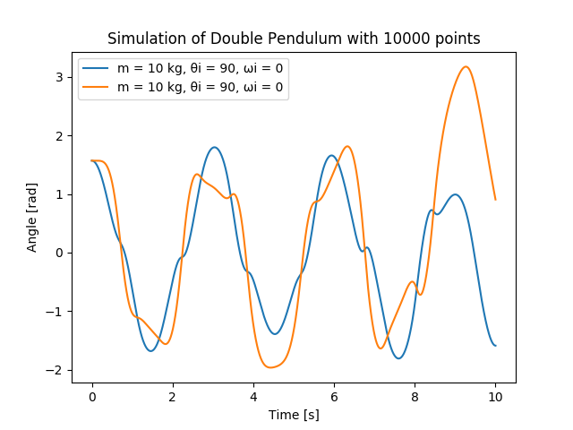

## ENGPHYS 213 Final

This is small python script that simulates a chaotic double pendulum.
The equations were taken from [this](http://scienceworld.wolfram.com/physics/DoublePendulum.html) link.
A more detailed description of the implementation can be found in the [pendulum.py](pendulum.py) file</a>.

The algorithim accurately computes the steady values for the system:

Similarily, the output for the case where m1 << m0 also appears logical:

The chaoticness of the system can be observed from the following charts:

Otherwise, these various outputs from the different input parameters

